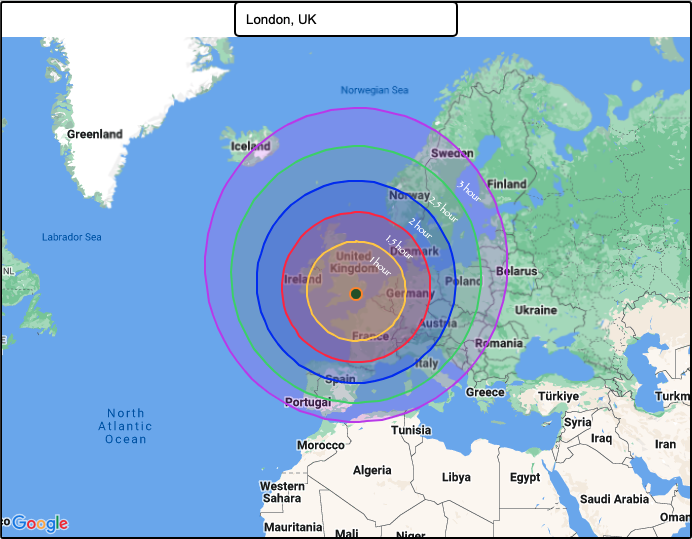

# Range Map with address search

## Description

This is a range calculation map with the location auto search functionality using google map javascript and places api.

## Installation

Provide step-by-step instructions on how to install your project locally. For example:

1. Clone the repo: `git clone https://github.com/bronsky1/range-map.git`
2. Generate the Google Map API from Google Developer Console
    - Enable the Google Map JavaScript service
    - Enable the Google Map Places service
3. Set the Google Map API Key

## Usage

